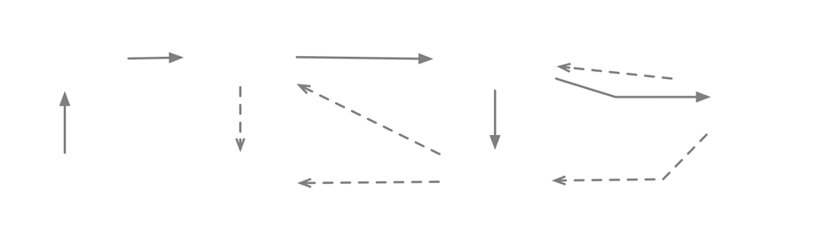

<div align="center">

# Strudel

**An Executable Modeling Language for Developing Educational Programming Tools**

[Installation](#installation) •
[What is Strudel?](#what-is-strudel) •
[How Does Strudel Work?](#how-does-strudel-work) •
[Examples](#examples)

</div>
<br>

<picture>
  <source media="(prefers-color-scheme: dark)" srcset="resources/overview-darkmode.png">
  <source media="(prefers-color-scheme: light)" srcset="resources/overview-lightmode.png">
  
</picture>

<br>

## Installation
**Strudel** is an experimental library, and as such is not yet available in build automation tools (Gradle, etc.)

To use Strudel in your project, first build its .jar file using Gradle's build task. The .jar file is generated under
the project root in `/build/libs`. This file should be copied to your own project's `libs` folder,
and then added as a dependency in your build automation tool of choice. For example, in Gradle:
```kotlin
dependencies {
    implementation(files("libs/strudel.jar"))
}
```


<br>

## What is Strudel?
**Strudel** is a meta-programming library for modeling structured programming aimed to serve as the core reusable 
asset of educational programming tools. Strudel provides an embeddable virtual machine that simulates a 
call stack-based execution, enabling third parties to observe every execution aspect in detail, such as 
errors, code coverage, tracking variables, loop iterations, call stack, or memory allocation.


<br>

## How Does Strudel Work?


By instantiating the classes described in the previous section we define a set of procedures. These can be executed, 
simulating the computational process based on a call stack and heap memory. This feature is embodied in the library 
as a VM that can be used programmatically.

A VM instance is represented by an object with which programs may interact to drive the simulation process. The 
simulation can be parameterized concerning the _maximum call stack size_, the _maximum number of iterations allowed 
for each loop execution_, and the _available heap memory_. In this way, one may simulate resource-constrained 
environments, or prepare contexts for programming exercises that ensure bounded resources for algorithm executions. 
Furthermore, the VM is "sandboxed" resource-wise and allows configurations that prevent expensive computations from 
executing.

Because one of our main goals is to have a form of seamless observation of program behavior, the VM exposes every 
aspect of the execution, allowing listeners to be plugged into the virtual machine.


<br>

## Examples
The following are simple examples that showcase Strudel's basic functionalities. For a more complete 
(but less documented) set of examples, check out [the examples folder](src/main/kotlin/pt/iscte/strudel/examples) 
and [the tests folder](src/test/kotlin).

<details>
<summary><b>Using Strudel's Internal DSL</b></summary>

Strudel models may be instantiated "manually" through an internal Domain-Specific Language (DSL).
The following code exemplifies the internal DSL for instantiating Strudel models illustrated with binary search.

```kotlin
val bsearch = Procedure(BOOLEAN, "bsearch") {
    val a = Param(array(INT), "a")
    val e = Param(INT, "e")
    val l = Var(INT, "l", 0)
    val r = Var(INT, "r", a.length() - 1)
        While(l smallerEq r) { 
        val m = Var(INT, "m", l + (r - l) / 2)
        If(a[m] equal e) {
            Return(True)
        }
        If(a[m] smaller e) {
            Assign(l, m + 1)
        }.Else {
            Assign(r, m - 1)
        }
    }
    Return(False)
}
```

</details>

<br>

<details>
<summary><b>Loading Java Source Code</b></summary>

To have a practical means to create Strudel models without having to deal with the library classes directly, we 
developed a translator for a subset of Java’s syntax, supporting primitive types and arrays, simple classes 
(without inheritance), all loop structures, if-statements, and method calls. Given that our focus is on educational 
systems, we are not concerned with fully supporting Java.

The following is an example of loading a Java source code file into Strudel and executing one of its 
procedures.

```kotlin
val f = File("BinarySearch.java")
val module = Java2Strudel().load(f) // Loading Java source code
val search = module.getProcedure("binarySearch")

val vm: IVirtualMachine = IVirtualMachine.create()

val a: IReference<IArray> = vm.allocateArrayOf(INT, 1, 3, 5, 7, 11, 13, 17, 23, 27)
val e: IValue = vm.getValue(23)

val result: IValue? = vm.execute(search, a, e) // true
```

Strudel's Java loading and translation features were implemented using the [JavaParser](https://javaparser.org/) 
library.

</details>

<br>

<details>
<summary><b>Use Case: Code Coverage</b></summary>

In this example, the listener keeps track of how many times each statement was executed. This could be useful to aid 
learners in realizing which path the execution followed towards the result. The listener captures every statement 
regardless of which procedure it belongs.

```kotlin
fun codeCoverage(
    procedure: IProcedure, 
    vm: IVirtualMachine, 
    vararg arguments: IValue
): Map<IStatement, Int> {
    class StatementCoverage : IVirtualMachine.IListener {
        val coverage = mutableMapOf<IStatement, Int>()
        override fun statement(s: IStatement) {
            coverage.putIfAbsent(s, 0)
            coverage[s] = coverage[s]!! + 1
        }
    }
    
    val listener = StatementCoverage()
    vm.addListener(listener)
    vm.execute(procedure, *arguments)
    vm.removeListener(listener)
    
    return listener.coverage
}
```

</details>

<br>

<details>
<summary><b>Use Case: Tracking Variables</b></summary>

Observing the history of variable values can aid in understanding the algorithmic behavior of  code. In Strudel, we 
can achieve this by capturing variable assignments using a listener that intercepts every assignment to a variable of 
the given procedure and store the list of values. Notice how easily runtime information can be related to the program model.

```kotlin
fun variableHistory(
    vm: IVirtualMachine,
    procedure: IProcedure,
    vararg arguments: IValue
): Map<IVariableDeclaration<*>, List<IValue>> {
    val history = mutableMapOf<IVariableDeclaration<*>, MutableList<IValue>>()

    val listener = object : IVirtualMachine.IListener {
        override fun variableAssignment(a: IVariableAssignment, value: IValue) {
            history.putIfAbsent(a.target, mutableListOf())
            history[a.target]?.add(value)
        }
    }

    vm.addListener(listener)
    vm.execute(procedure, *arguments)
    vm.removeListener(listener)

    return history
}
```

</details>

<br>

<details>
<summary><b>Use Case: Measuring Iterations</b></summary>

The number of iterations is a usual metric to evaluate an algorithm’s performance, which is relevant in the study of 
algorithms. Using Strudel, one may plug a listener for loop iterations, and hence, easily count iterations. Notice 
that this may aid learners in analyzing the performance of their implementations by identifying the number of executed 
iterations for different inputs. Further, an automated assessment system may use this facility for checking algorithm 
correction. This example also relates runtime information and program model, by checking if the iteration occurred 
within the procedure given as argument.

```kotlin
fun countIterations(
    procedure: IProcedure,
    vm: IVirtualMachine,
    vararg arguments: IValue
): Int {
    class LoopCounter : IVirtualMachine.IListener {
        var iterations = 0
        override fun loopIteration(loop: ILoop) {
            if(vm.topFrame.procedure == procedure)
                iterations++
        }
    }
    
    val listener = LoopCounter()
    vm.addListener(listener)
    vm.execute(procedure, *arguments)
    vm.removeListener(listener)
    
    return listener.iterations
}
```

</details>


<br>

## Projects using Strudel

Check out the following publications and/or projects, which use Strudel as a runtime environment:

- [Jask: Generation of Questions About Learners' Code in Java](https://dl.acm.org/doi/10.1145/3502718.3524761)
- [Jinter: A Hint Generation System for Java Exercises](https://dl.acm.org/doi/abs/10.1145/3587102.3588820)
- [Witter: A Library for White-Box Testing of Introductory Programming Algorithms](https://github.com/ambco-iscte/witter)


<br>
